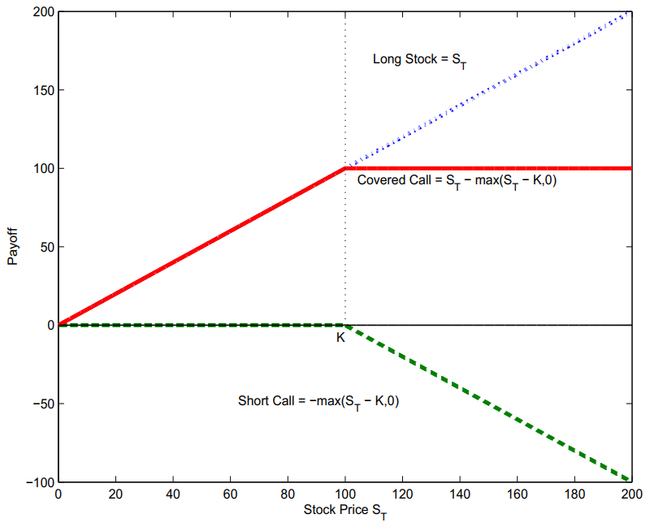
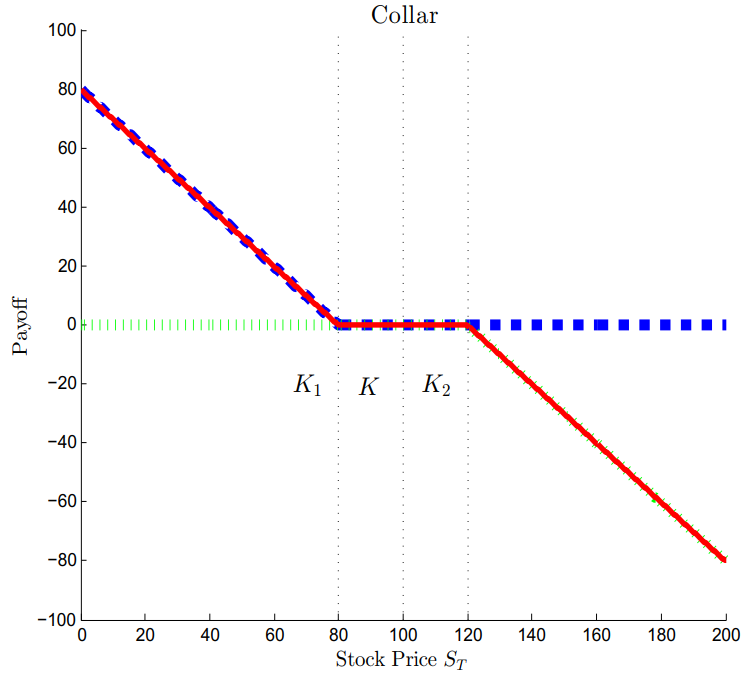
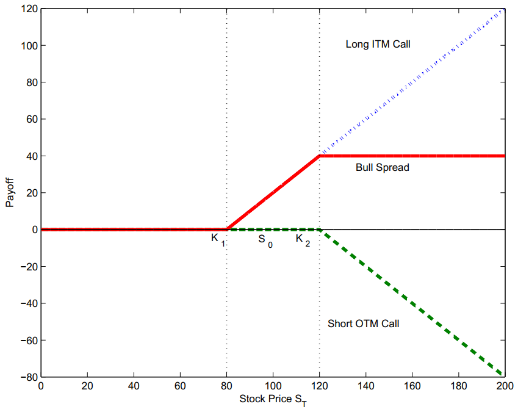
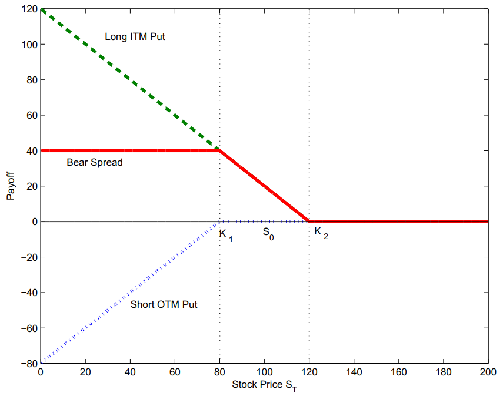
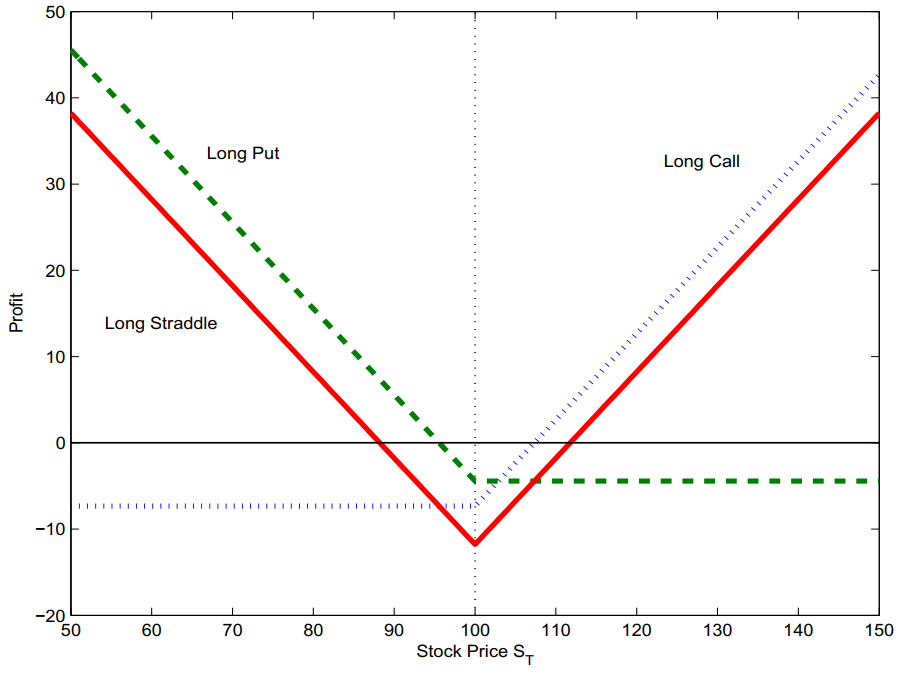
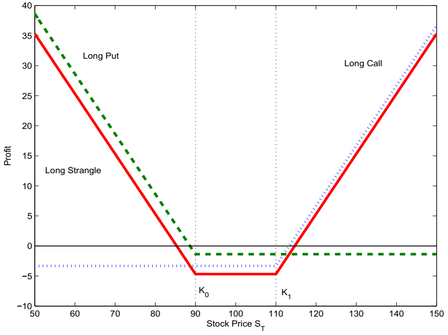
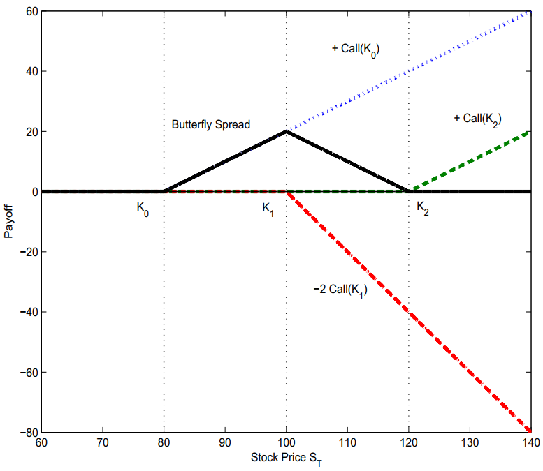
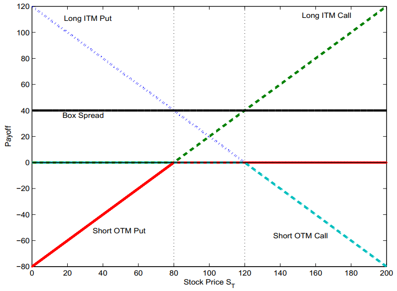

# FINA3203

FINA3203	Derivative Securities  
Spring 2018, HKUST  
Notes by **Gerald Liu**  
[wliuax@connect.ust.hk](mailto:wliuax@connect.ust.hk)

[TOC]

## Forwards & Futures

$F_{0,T}=V_T(S)=S_0\cdot e^{r_0 T}$, traded on OTC markets

- biased as a prediction: $\mathbb{E}_0[S_T]=S_0\cdot e^{\mu_0 T}=F_{0,T}\cdot e^{(\mu_0-r_0) T}$, where $\mu_0-r_0$ is the risk premium
- $V_{t,T}=(F_{t,T}-F_{0,T})\cdot e^{-r_t(T-t)}=S_t-F_{0,T}\cdot e^{-r_t(T-t)}$ for long forwards

Futures (v.s. forwards): traded on exchanges, standardized (liquidity risk $\downarrow$, introduces basis risk),  
marked to market (counterparty risk $\downarrow$, centralized at clearinghouse v.s. bilateral negotiation)

Notional Value = Index Value &times; Contract Size &times; Number of contracts

Daily Margin $M_t=M_{t-1}\cdot e^{r\Delta t}+(\hat{F}_{t,T}-\hat{F}_{t-1,T})\times \text{contract size}\times \text{# of contracts}$ for long futures

Hedging: short $K_t=\text{# of contracts}\times e^{-r(T-t\cdot\Delta t)}$ per period, Payoff at T = $(\hat{F}_{t,T}-S_0)\cdot \text{size}\cdot \#$

### Financial Assets

For stocks with dividends: $F_{0,T}=V_T(S-D)$

- known dividend: $F_{0,T}=(S_0-PV_0(D))\cdot e^{r_0 T}$, where $PV_0(D)=\sum D_t\cdot e^{-rt}$

  Similarly: treasury bond forwards (see the coupons as dividends)

- constant dividend yield: $F_{0,T}=S_0\cdot e^{(r_0-q) T}$, where $q=\frac{d(D_t/S_t)}{dt}$

Repo transactions: A sells treasury bills, B lends cash; A pays back funds & interests, B returns treasury bills

- Haircut = Collateral / Borrowed - 1 = %Excess Collateral
- Repo interest rate is riskless

### Commodities

1. Contango (gold, copper) &lArr; storage costs, effective interest rate $\hat{r}=r+\lambda$

   $F_{0,T}=S_0\cdot e^{\hat{r}T}=S_0\cdot e^{(r+\lambda)T}$, where constant carry cost payment intensity $\lambda = \frac{d(\Lambda_t/S_t)}{dt} = -\frac{d^2N_t}{dt}$

2. Backwardation (oil, soybean) &lArr; leasing, convenience yield (non-pecuniary gain)

   $F_{0,T}=S_0\cdot e^{(\hat{r}-\hat{q})T}=S_0\cdot e^{(r-q)T}​$, where effective lease rate $\hat{q}=q+\lambda​$

   $F_{0,T}=S_0\cdot e^{(\hat{r}-c)T}=S_0\cdot e^{(r+\lambda-c)T}$, where $c \in [0, c_{max}]$

   For futures: $F_{0,T}=S_0\cdot e^{(r+\bar{\lambda}-\bar{c})T}$, short/long based on investor's $\lambda-c$

   Backwardation of the non-storable: estimate $S_0$ with $PV_0(S_T)$

   $F_{0,T}=PV_0(S_T)\cdot e^{rT}=\mathbb{E}_0[S_T]\cdot e^{(r-\mu)T}$, where $\mathbb{E}_0[S_T]=PV_0(S_T)\cdot e^{\mu T}$, $\mu-r$ is the risk premium

Cash-and-carry trade: Short forward, long underlying

### Interest Rates

Forward rate $f_{t_1,t_2,t_3}=\frac{1}{t_3-t_2}[r_{t_1,t_3}(t_3-t_1)-r_{t_1,t_2}(t_2-t_1)]$

FRA Settlement (short to gain if interest rate drops):
$$
C_{FRA, t_i, T}=\frac{(r_{FRA, t_i}-r_{s,t_i})(T-t_i)}{1+r_{s,t_i}(T-t_i)}  \times N_{t_i} \impliedby (N+C_{FRA})(1+r_s (T-t))=N(1+r_{FRA} (T-t))
$$
where $r_{FRA, t_i}=e^{f_{0, t_i, T}} - 1​$, $r_{s,t_i}=e^{r_{t_i, T}}-1​$ are annualized **simple** interest rates.

Short FRA to hedge for lending (investing) at FRA in the future (gains reinvested & losses covered),  
or to speculate on a too-high FRA by longing the bonds at the same time:

|                  | CF at 0              | CF at $t_i$                     | CF at $T$ |
| ---------------- | ------------------------------------- | ------------- | ------------- |
| Short FRAs       | 0 | $C_{FRA, t_i, T}=\ldots \times N$ |  |
| Reinvest/Borrow |  | $-(N+C_{FRA})$ | $\sum_{t_i=t_1}^{t_{m-1}} N\cdot e^{f_{FRA,t_i,T}(T-t_i)}$ |
| Long Bonds | $-\sum_{t_i=t_1}^{T} N\cdot e^{-r_{0,t_i}\cdot t_i}$ | $N$ | $N$ |
| **Net**   | $-\sum_{t_i=t_1}^{T} N\cdot e^{-r_{0,t_i}\cdot t_i}$ | 0 | $\sum_{t_i=t_1}^{T} N\cdot e^{f_{FRA,t_i,T}(T-t_i)}$ |

No arbitrage: $(\sum_{t_i=t_1}^{T} N\cdot e^{-r_{0,t_i}\cdot t_i}) \cdot e^{r_{0,T}\cdot T} =\sum_{t_i=t_1}^{T} N\cdot e^{r_{0,T}\cdot T-r_{0,t_i}\cdot t_i}=\sum_{t_i=t_1}^{T} N\cdot e^{f_{FRA,t_i,T}(T-t_i)}$

Eurodollar futures price at T = $100-\text{LIBOR}_{T, T+90/360}$	(annualized 3-month LIBOR)

### Currencies

Reserve Currency (USD, GBP, EUR), Commodity Currency (AUD, CAD), Pegged Currency (HKD, SGD)

$F_{0,T}=M_{0}\cdot e^{(r-r^*)T}$, where $M_0$ = USD/XXX &rArr; Covered Interest Parity: $\mathrm{ln}(F_{T})-\mathrm{ln}(M_0)=r-r^*$

Currency carry trade: short EUR forward, borrow USD at $r$ to buy and lend EUR at $r^*>r$

Uncovered Interest Parity: $\mathbb{E}[M_T]=F_{0,T}$, i.e. $\mathrm{ln}(\mathbb{E}[M_T])-\mathrm{ln}(M_0)=r-r^*$ &rArr; no arbitrage for carry trade

Empirical relation: $\mathrm{ln}(M_{t+1})-\mathrm{ln}(M_t)=\alpha+\beta(r-r^*)+\epsilon_t$ &rArr; $\mathbb{E}[M_T]=M_0 e^{\beta (r-r^*)}<F_{0,T}$, with $\beta<0$  
&rArr; carry trade earns a risk premium

## Swaps

To hedge repeated risky transactions: a sequence of forwards coupled with FRAs; traded on OTC

### Commodities

Short swap at price $x$ is equivalent to:

1. short $\sum_1^m [N_0 \text{ forward at } F_{0,t_i}]$;

2. [to neutralize the gains or losses from swap + forward]

   long $\sum_1^{m-1} [N_0(K-F_{0,t_i}) \text{ FRA at } f_{FRA, t_i,T}]$ to ensure all reinvestments and loans will cancel out at T.

|                  | CF at $1\leq t_i < T$            | CF at $T$ |
| ---------------- | ------------------------------------- | ------------- |
| Short Swap       | $K-S_{t_i}$                     | $K-S_{T}$ |
| Long Forwards    | $S_{t_i}-F_{0,t_i}$                 | $S_{T}-F_{0,T}$ |
| Short FRAs       | $C_{FRA, t_i, T}=\ldots \times (K-F_{0,t_i})$ |  |
| Reinvest/Borrow | $-(K-F_{0,t_i}+C_{FRA})$ | $\sum_{t_i=t_1}^{t_{m-1}} (K-F_{0,t_i})e^{f_{FRA,t_i,T}(T-t_i)}$ |
| **Net**          | 0 | $(K-F_{0,T})+\sum_{t_i=t_1}^{t_{m-1}} (K-F_{0,t_i})e^{f_{FRA,t_i,T}(T-t_i)}$ |

$$
\begin{aligned}
&\ (K-F_{0,T})+\sum_{t_i=t_1}^{t_{m-1}} (K-F_{0,t_i})e^{f_{FRA,t_i,T}(T-t_i)}=0 \\
\implies &\ \sum_{t_i=t_1}^{T} (K-F_{0,t_i})e^{r_{0,T}\cdot T-r_{0,t_i}\cdot t_i}=0 \\
\implies &\ \sum_{t_i=t_1}^{T} (K-F_{0,t_i})e^{-r_{0,t_i}\cdot t_i}=0 \\
\implies &\ K=\sum_{t_i=t_1}^{T} F_{0,t_i}\frac{e^{-r_{0,t_i}\cdot t_i}}{\displaystyle\sum_{t_j=t_1}^{T} e^{-r_{0,t_j}\cdot t_j}}
\end{aligned}
$$

Value of swap (e.g. short) = Cost to enter into an offsetting swap (e.g. long)

$$
\begin{aligned}
V_t&=(K-K_t)\sum_{t_i=t_k}^T e^{-r_{t,t_i}\cdot(t_i-t)} \\
&=\sum_{t_i=t_k}^T (K-F_{t,t_i})e^{-r_{t,t_i}\cdot(t_i-t)} ,\quad\text{where}\ t<t_k<\ldots<T
\end{aligned}
$$

### Interest Rates

- commercial banks long IRS, pay fixed CF from loans, receive floating CF to pay interests
- companies short IRS, pay floating CF from short-term debts, receive fixed CF to pay as fixed-rate loan

Short swap at price x is equivalent to: short $\sum_{t_1}^{T} [\text{ FRA at } r_{FRA, t_i, t_{i+1}}]$ at $t_{i-1}$, reinvest/borrow

$$
C_{FRA, t_{i-1}, t_i}=\frac{r_{float, t_{i-1}, t_i}-r_{FRA, t_{i-1}, t_i}}{1+r_{float, t_{i-1}, t_i}}
$$

|                  | CF at 1 | CF at $1<t_i< T$ | CF at T |
| ---------------- | ------------------------------------- | ------------------------------------- | ------------------------------------- |
| Short Swap       | $r-r_{float, 0, t_1}$ | $r-r_{float, t_{i-1}, t_{i}}$ | $r-r_{float, t_{m-1}, T}$ |
| Long FRAs | $C_{FRA, t_1, t_2}$ | $C_{FRA, t_i, t_{i+1}}$ |  |
| Reinvest/Borrow | $-C_{FRA, t_1, t_2}$ | $-C_{FRA, t_i, t_{i+1}}$ |  |
| Payoff from last Reinvest/Borrow |  | $r_{float, t_{i-1}, t_i}-r_{FRA, t_{i-1}, t_i}$ | $r_{float, t_{m-1}, T}-r_{FRA, t_{m-1}, T}$ |
| **Net**          | $r-r_{float, 0, t_1}$ | $r-r_{FRA, t_{i-1}, t_i}$ | $r-r_{FRA, t_{m-1}, T}$ |

Note:

- $r_{float, 0, t_1}=r_{FRA, 0, t_1}$
- [Long FRAs & reinvest/borrow] can be regarded as [Long forwards] in commodity swaps

$$
\begin{aligned}
& r\Delta t_j\sum_{t_j=t_1'}^{T} e^{-r_{0,t_j}\cdot t_j}=\sum_{t_i=t_1}^{T}r_{FRA, t_{i-1}, t_i}\Delta t_i e^{-r_{0,t_i}\cdot t_i}\\
&\text{Assume}\ r_{\text{float}} = r,\ \text{i.e. floating rate bond sell at par, }\quad
r\Delta t_j\sum_{t_j=t_1'}^{T} e^{-r_{0,t_j}\cdot t_j}=  1-e^{-r_{0,T}\cdot T} \\
\implies & r=\frac{\Delta t_i \sum r_{FRA, t_i}P_i(0,t_i) }{\Delta t_j \sum P_j(0,t_j)}=\frac{1-P(0,T) }{\Delta t_j \sum P_j(0,t_j)}, \quad \text{where the discount factor}\ P(0,t)=  e^{-r_{0,t}\cdot t} \\ \ \\
&\sum_{t_i=t_1}^{T} (r-r_{FRA, t_{i-1}, t_i})e^{-r_{0,t_i}\cdot t_i}=0  \quad (\text{Assume}\ t_i=t_j) \\
\implies &r=\sum_{t_i=t_1}^{T} r_{FRA,t_{i-1},t_i}\frac{e^{-r_{0,t_i}\cdot t_i}}{\displaystyle\sum_{t_j=t_1}^{T} e^{-r_{0,t_j}\cdot t_j}}
=\sum_{t_i=t_1}^{T}r_{FRA,t_{i-1},t_i} \frac{(1+r_{float,0,t_i}\cdot t_i)^{-1}}{\displaystyle\sum_{t_j=t_1}^{T}(1+r_{float,0,t_j}\cdot t_j)^{-1}}
\end{aligned}
$$

Note: Fixed payment period (e.g. $t_j=\frac{t}{2}$) can be different from floating payment period (e.g. $t_i=\frac{t}{4}$)!

Value of swap (e.g. short):
$$
\begin{aligned}
V_t&=\sum_{t_i=t_k}^T (r-r_{FRA(t), t_{i-1}, t_i})e^{-r_{t,t_i}\cdot(t_i-t)} \\
&=\sum_{t_i=t_k}^T \frac{r-r_{FRA(t), t_{i-1}, t_i}}{1+r_{float,t,t_i}\cdot t_i}, \quad\text{where}\ t<t_k<\ldots<T
\end{aligned}
$$

### Currencies

#### Currency Swaps

Exchange of two loans in two currencies: ($R$ and $R^*$ are coupon rates &ndash; **simple** rates)

equivalent to short forwards of the other currency.

|                  | CF at $t_i$ | CF at T |
| ---------------- | ------------------------------------- | ------------------------------------- |
| Short Swap       | $R-R^*S_{t_i}$ | $(1+R)-(1+R^*)S_{t_i}$ |
| Long Forwards | $R^*(S_{t_i}-F_{0,t_i})$ | $(1+R^*)(S_{t_i}-F_{0,t_i})$ |
| **Net**          | $R-R^*F_{0,t_i}$ | $(1+R)-(1+R^*)F_{0,T}$ |

$$
\begin{aligned}
&\ \sum_{t_i=t_1}^{t_{m-1}} e^{-r_{0,t_i}\cdot t_i}(R-R^*F_{0,t_i})+e^{-r_{0,T}\cdot T}[(1+R)-(1+R^*)F_{0,T}]=0 \\
\implies &\ R=\sum_{t_i=t_1}^{T} R^*F_{0,t_i}w_{t_i}+(F_{0,T}-1)w_T, \quad \text{where}\ w_{t_i}=\frac{e^{-r_{0,t_i}\cdot t_i}}{\displaystyle\sum_{t_j=t_1}^{T} e^{-r_{0,t_j}\cdot t_j}}
\end{aligned}
$$
Special case: If risk-free rates are constant ($r_{0,t_i}=r​$, $r^*_{0,t_i}=r^*​$) and $1+R^*=e^{r^*}​$, then $1+R=e^{r}​$
$$
\begin{aligned}
& \sum_{t_i=1}^{T-1} e^{-r\cdot t_i}R+e^{-r\cdot T}(1+R) \\
=& \sum_{t_i=1}^{T-1} e^{-r\cdot t_i}R^*F_{0,t_i}+e^{-r\cdot T}(1+R^*)F_{0,T} \\
=& \sum_{t_i=1}^{T-1} e^{-r\cdot t_i}R^*\cdot S_0e^{(r-r^*)t_i}+e^{-r\cdot T}(1+R^*)\cdot S_0e^{(r-r^*)T} \\
=& S_0[\sum_{t_i=1}^{T-1} e^{-r^*\cdot t_i}R^*+e^{-r^*\cdot T}(1+R^*)]= S_0[\sum_{t_i=1}^{T-1} \frac{R^*}{(1+R^*)^{t_i}}+\frac{1+R^*}{(1+R^*)^{T}}] \\
=& S_0
\end{aligned}
$$

The bond (loan) is sold at par, i.e. the coupon rate $R$ = risk-free interest rate $r_s$ = $e^r-1$

#### Foreign Exchange Swaps

Exchange of two currencies, short &rArr; receive at fixed exchange rate, pay at spot rates

$0=\sum e^{-rt_i}(K-F_{0,t_i})\implies K=M_0\cdot \frac{\sum e^{-r^*t_i}}{\sum e^{-rt_i}}$, where $F_{0,t_i}=M_{0}\cdot e^{(r-r^*)T}$

$$
\begin{aligned}
V_t&=\sum_{t_i=t_k}^T (K-F_{t,t_i})e^{-r(t_i-t)} \\
&=K\sum_{t_i=t_k}^T e^{-r(t_i-t)}-S_t\sum_{t_i=t_k}^T e^{-r^*(t_i-t)} , \quad\text{where}\ t<t_k<\ldots<T
\end{aligned}
$$

### Total Return

one party makes payments based on a set rate, either fixed or variable, while the other party makes payments based on the return of an underlying asset.

e.g. One party (Bank A) pays the total return of a junk corporate bond and the other (Bank B) pays the total return of treasury plus a spread.  
"regulatory arbitrage": to gain leverage (Bank B), exploit funding cost advantage (Bank A), circumvent regulation (e.g., Bank B may not be allowed hold junk bonds), etc.

Foreign Exchange Swaps + Total Return Swaps:  
borrow in the other currency, swap payments to service debt and profits transfers

### Volatility

To exchange the realized volatility for a pre-specified fixed volatility: $(\sigma_{realized}-K_{vol})\times N$

variance swaps: replace volatility with variance

## Options

A European option gives its holder the right, but not the obligation, to buy (call) or sell (put) for K at T.  
An American option is the same, but exercise can occur any time before maturity.

Stock options: 1 contract = 100 shares

Options: insurance, keeping the original upside  
Forwards: perfect hedge, zero upfront payment

$$
\begin{aligned}
\text{Payoff of a call}=\mathrm{max}(S_T-K,0)
\begin{cases}
\approx S_t-Ke^{-r(T-t)}, \quad &S_t>>K \ \text{(Deep In the Money, DITM)} \\
>0 \quad &S_t>K \ \text{(In the Money, ITM)} \\
\approx 0, \quad &S_t<<K \ \text{(Out of the Money, OTM)} \\
\end{cases} \\
\text{Payoff of a put}=\mathrm{max}(K-S_T,0)
\begin{cases}
\approx Ke^{-r(T-t)}-S_t, \quad &S_t<<K \ \text{(Deep In the Money, DITM)} \\
>0 \quad &S_t<K \ \text{(In the Money, ITM)} \\
\approx 0, \quad &S_t>>K \ \text{(Out of the Money, OTM)} \\
\end{cases} \end{aligned} \\ \ \\
\text{At the money, ATM:}\quad S_t=K
$$
Put-Call Parity: Long Put & Short Call equals a Short Forward  
$\text{Put} - \text{Call} = e^{-rT}(K-F_{0,T})=Ke^{-rT}-S_0$

Arbitrage with synthetic call (long put, long forward) or synthetic put (long call, short forward).

Option premium non-arbitrage region:
$$
\begin{aligned}
\mathrm{max}(0,S_t-Ke^{-r(T-t)})\leq &\text{Call} \leq S_t \\
\mathrm{max}(0,Ke^{-r(T-t)}-S_t)\leq &\text{Put} \leq Ke^{-r(T-t)}
\end{aligned}
$$

### Trading Strategies

#### Basic

|         Protective Put         |         Covered Call         |         Collar         |
| :----------------------------: | :--------------------------: | :--------------------: |
|  |  |  |

#### Directional

Forwards: downside risk too large  
Options: upfront payment (option premium) too large &rArr; need to reduce profit

|         Bull Spread         |         Bear Spread         |
| :----------------------------: | :--------------------------: |
|  |  |

#### Volatility

|         Straddle         |         Strangle         |      Butterfly Spread       |
| :----------------------: | :----------------------: | :-------------------------: |
|  |  |  |

#### Others

Box Spread: synthetic risk-free short-term bond without tax

## Pricing

### Risk Neutral Pricing

Assume everyone is risk-neutral, solve $V_0=e^{-rT}\mathbb{E}_0^*[\mathcal{G}(S_T)]$, where $\mathcal{G}(S_T)$ is the payoff function.

To account for risk aversion: add a risk premium, or distort the probabilities.

Forward price is the risk-neutral expectation: $\mathcal{G}(S_T)=S_T-F_{0,T}$ for long forwards
$$
\begin{aligned}
&\ 0=V_0=e^{-rT}\mathbb{E}^*[S_T-F_{0,T}] \\
\implies &\ F_{0,T}=\mathbb{E}^*[S_T]=S_0e^{rT}
\end{aligned}
$$
Swap price: $\mathcal{G}(S_{t_i})=S_{t_i}-K​$ for long swaps
$$
\begin{aligned}
&\ 0=V_0=\sum e^{-rt_i}\mathbb{E}^*[S_{t_i}-K] \\
\implies &\ K=\frac{1}{\sum e^{-rt_i}}\sum e^{-rt_i}\mathbb{E}^*[S_{t_i}]=\sum F_{0,t_i}\frac{e^{-rt_i}}{\sum e^{-rt_i}}
\end{aligned}
$$

Binomial tree pricing: e.g. for long stocks, $\mathcal{G}(S_T)=q^*S_{T,u}+(1-q^*)S_{T,d}​$
$$
\begin{aligned}
S_0&=V_0=e^{-rT}[q^*S_{T,u}+(1-q^*)S_{T,d}] \\
\implies q^*&=\frac{S_0e^{rT}-S_{T,d}}{S_{T,u}-S_{T,d}} \\
&=\frac{e^r-(1+d)}{u-d}=\frac{r_s-d}{u-d} \quad \text{for T=1}
\end{aligned}
$$

### Multi-Step Binomial Tree

Backward Induction: chop off the time interval into n intervals of size $h = T/n$.

#### Method 1: Replicating Portfolios

e.g. long call options: replicated by $\Delta$ shares of stock and $B$ risk-free bond.

Consider a portfolio of long call options hedged with shorting stocks:  
$\Delta$ is the sensitivity of call price to changes in the stock price.
$$
C_{i+1,u}-\Delta \cdot S_{i+1, u}=\Pi_{i+1}=C_{i+1,d}-\Delta \cdot S_{i+1, d} \\
\implies \Delta_i =\frac{C_{i+1,u}-C_{i+1,d}}{S_{i+1,u}-S_{i+1,d}} =\frac{C_{i+1,u}-C_{i+1,d}}{S_i(u-d)} \\
$$

Replicate $C_{i}=\Delta_i\cdot S_i+\Pi_i$ with $C_i=\Delta_i\cdot S_i+B_i$ :
$$
\begin{aligned}
B_i = \Pi_i&=e^{-rh}\Pi_{i+1} \\
&=e^{-rh}(C_{i+1,u}-\Delta \cdot S_{i+1, u}) \\
&=e^{-rh}\frac{C_{i+1,d}S_{i+1,u}-C_{i+1,u}S_{i+1,d}}{S_{i+1,u}-S_{i+1,d}} \\
&=e^{-rh}\frac{(1+u)C_{i+1,d}-(1+d)C_{i+1,u}}{u-d}
\end{aligned}
$$

#### Method 2: Risk Neutral Pricing

$$
\begin{aligned}
C_{i,j}&=e^{-rh}\mathbb{E}^*[C_{i+1}|(i,j)]\\
&=e^{-rh}[q^*C_{i+1,j}+(1-q^*)C_{i+1,j+1}], \quad \text{where}\ q^*=\frac{e^{rh}-(1+d)}{u-d}
\end{aligned}
$$

(for $q$ instead of $q^*$, change $r$ to $\mu$) 

### Black-Scholes-Merton

#### Assumptions

- Frictionless markets (no taxes or transaction costs, assets perfectly divisible, short sales unrestricted)
- Interest rates for borrowing and lending are the same and constant
- Stock prices conform to the log-normal model
  - stock prices follow a continuous path
  - mean &mu; and variance &sigma;^2^ of log return are constant
  - log return over any period is independent of log return over any other period
  - log return is normally distributed

#### Formula

Dynamic replicating portfolio with &Delta; in stock and B in bond:
$$
\begin{aligned}
\Delta_C&=\frac{\partial C}{\partial S}=\mathcal{N}(d_1)>0 \\
\Delta_P&=\frac{\partial C}{\partial S}=-\mathcal{N}(-d_1)>0
\end{aligned} \\
\mathcal{N}(d_1):\text{risk neutral PV of expected gross return at T} \\ \ \\
\begin{aligned}
B_C&=-Ke^{−r(T−t)}\mathcal{N}(d_2) <0 \\
B_P&=Ke^{−r(T−t)}\mathcal{N}(-d_2) >0
\end{aligned} \\
\mathcal{N}(d_2):\text{risk neutral probability to be ITM at T} \\ \ \\
\begin{aligned}
C&=\Delta_C S+B=S\mathcal{N}(d_1)-Ke^{−r(T−t)}\mathcal{N}(d_2) \\
P&=\Delta_P S+B=Ke^{−r(T−t)}\mathcal{N}(-d_2)-S\mathcal{N}(-d_1)
\end{aligned} \\
\begin{aligned}
\text{where}\qquad d_1&=\frac{\mathrm{ln}(\frac{S}{K})+(r+\frac{1}{2}\sigma^2)(T-t)}{\sigma \sqrt{T-t}} \\
d_2=d_1-\sigma \sqrt{T-t}&=\frac{\mathrm{ln}(\frac{S}{K})+(r-\frac{1}{2}\sigma^2)(T-t)}{\sigma \sqrt{T-t}}
\end{aligned}
$$
For 1-step binomial tree,
$$
\begin{aligned}
C_0&=e^{-rT}\mathbb{E}^*[\mathrm{max}(S_T-K,0)] \\
&=e^{-rT}q^*(S_{1,u}-K) \\
&=S_0\mathcal{N}_1-e^{-rT}K\mathcal{N}_2 \\
\end{aligned} \\ \ \\
\begin{aligned}
\text{where}\ \mathcal{N}_1&=e^{-rT}q^*(1+u)=1 - e^{-rT}(1-q^*)(1+d) < 1 \\
\mathcal{N}_2&=q*
\end{aligned}
$$
To satisfy the log-normal model (mean &mu; and variance &sigma;^2^ of log return are constant),
$$
\begin{cases}
\begin{aligned}
\mathbb{E}[\frac{S_{t+1}}{S_t}]&=q(1+u)+(1-q)(1+d)=e^{\mu T/n} \\
\mathbb{E}[(\frac{S_{t+1}}{S_t}-e^{\mu T/n})^2]&=q(1+u-e^{\mu T/n})^2+(1-q)(1+d-e^{\mu T/n})^2=\sigma^2T/n \\
(1+u)(1+d)&=1
\end{aligned}
\end{cases} \\ \ \\
\implies\begin{cases}
\begin{aligned}
1+u&=\mathrm{exp}(\sigma \sqrt{T/n}) \\
1+d&=\frac{1}{1+u}=\mathrm{exp}(-\sigma \sqrt{T/n})
\end{aligned}
\end{cases}
$$
and use risk-neutral probability:
$$
q^*=\frac{\mathrm{exp}(rT/n)-(1+d)}{u-d}=\frac{\mathrm{exp}(rT/n)-\mathrm{exp}(-\sigma \sqrt{T/n})}{\mathrm{exp}(\sigma \sqrt{T/n})-\mathrm{exp}(-\sigma \sqrt{T/n})}
$$
Let $j^∗$ be the smallest integer for which $S_j \geq K$ for $j \geq j^*$,
$$
\begin{aligned}
C_0&=e^{-rT}\sum_{j=0}^n\binom{n}{j}(q^*)^j(1-q^*)^{n-j}\mathrm{max}(S_j-K,0) \\
&=e^{-rT}\sum_{j=j^*}^n\binom{n}{j}(q^*)^j(1-q^*)^{n-j}(S_j-K) \\
&=S_0\mathcal{N}_1-e^{-rT}K\mathcal{N}_2
\end{aligned} \\ \ \\
\begin{aligned}
\text{where}\qquad \mathcal{N}_1&=e^{-rT}\sum_{j=j^*}^n\binom{n}{j}[q^*(1+u)]^j[(1-q^*)(1+d)]^{n-j} \\
\mathcal{N}_2&=\sum_{j=j^*}^n\binom{n}{j}(q^*)^j(1-q^*)^{n-j}
\end{aligned}
$$
When $n \to \infty$, we have $\mathcal{N}_1 \to\mathcal{N}(d_1)$, $\mathcal{N}_2 \to\mathcal{N}(d_2)$.